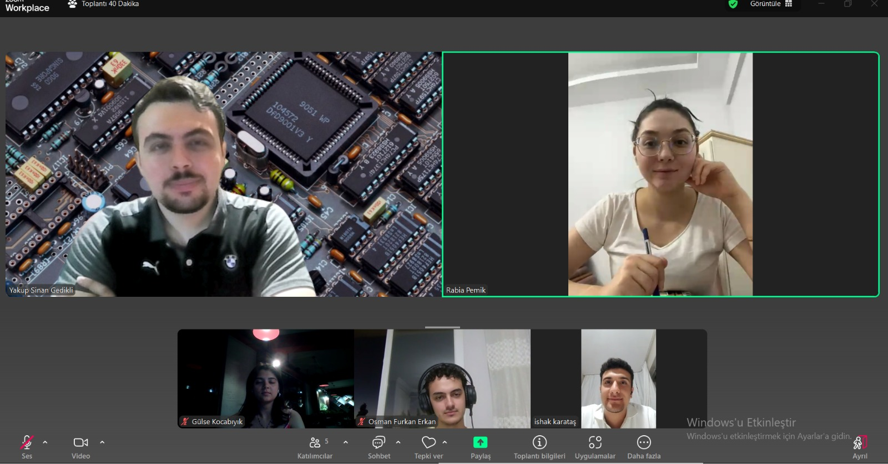
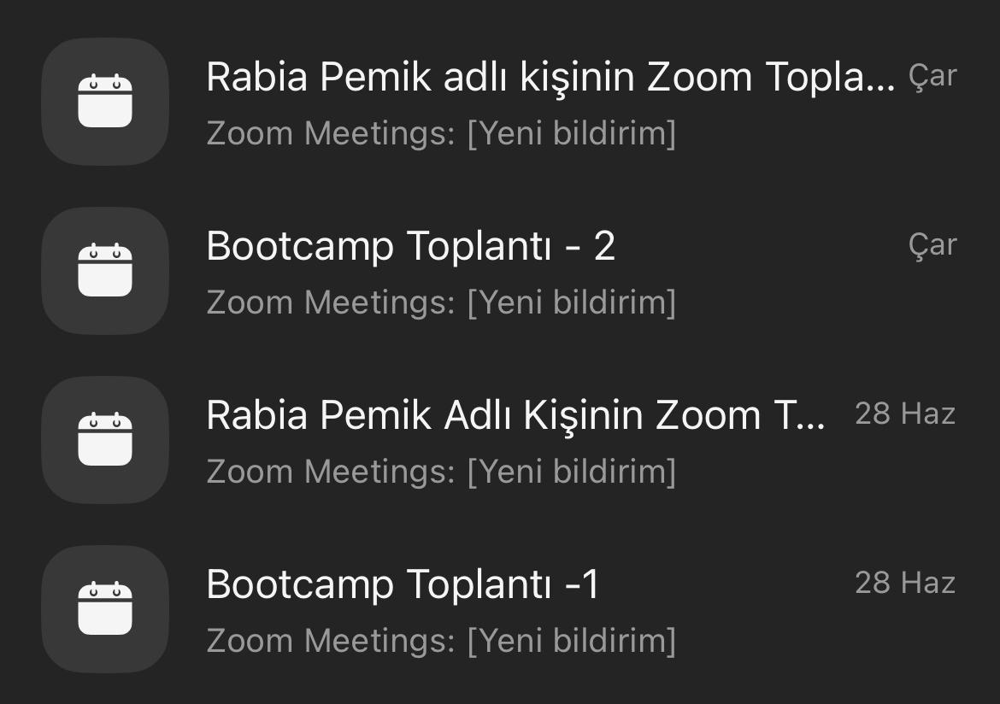
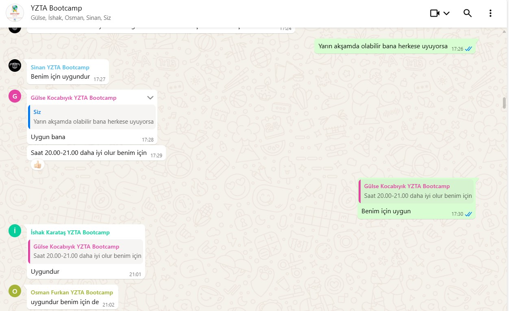
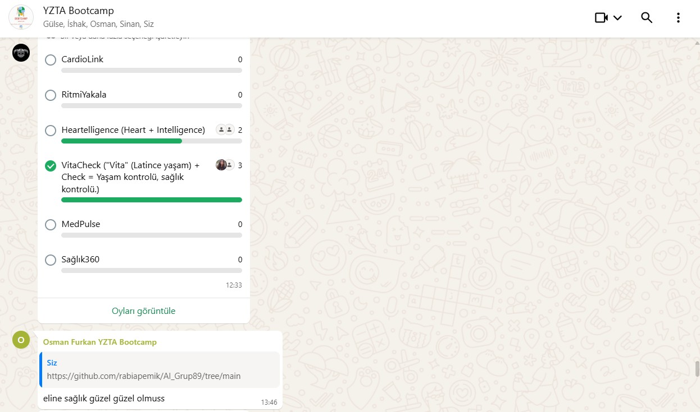
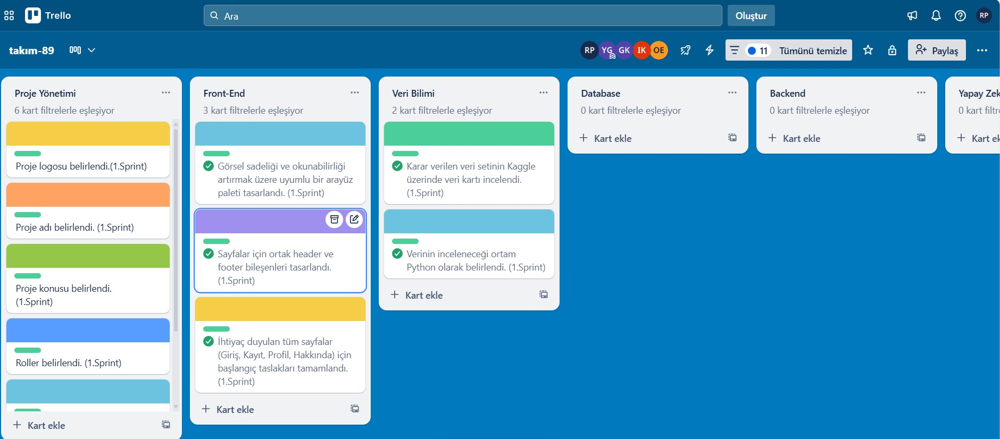
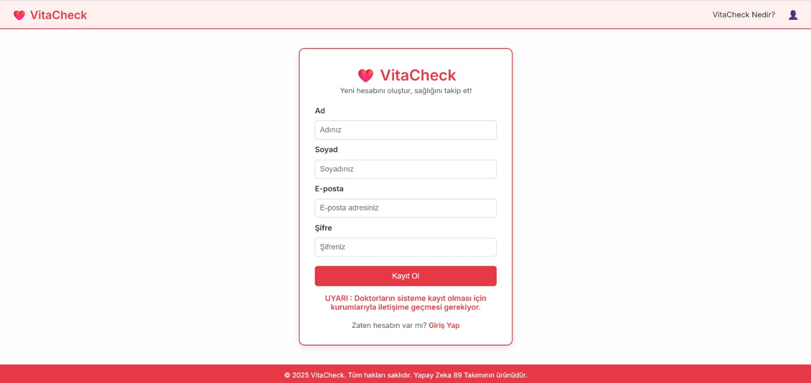
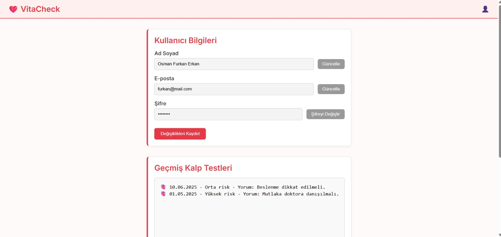
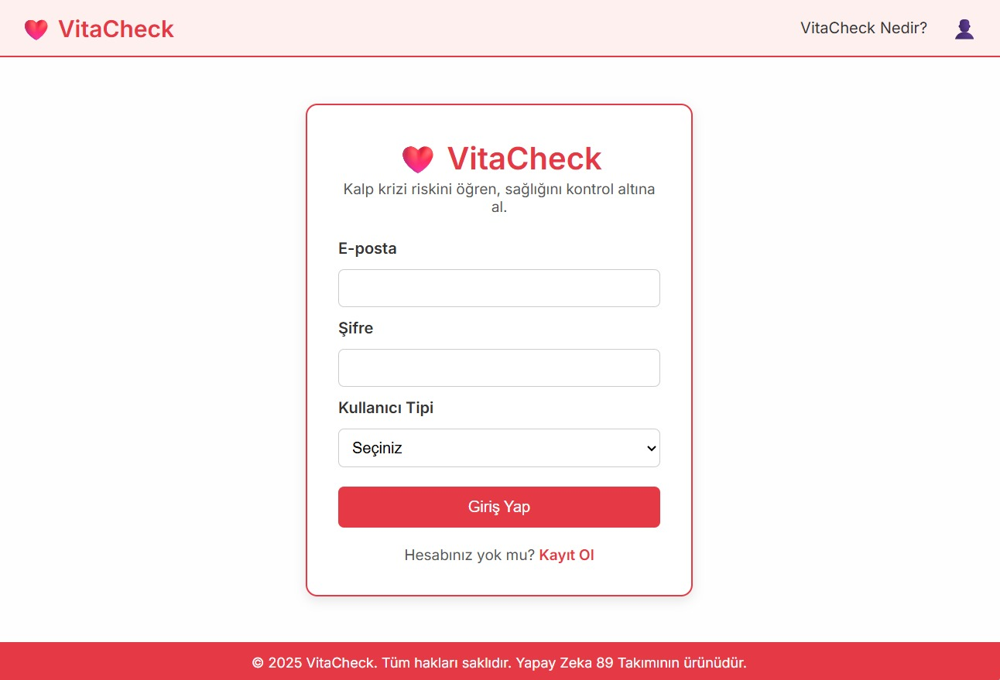
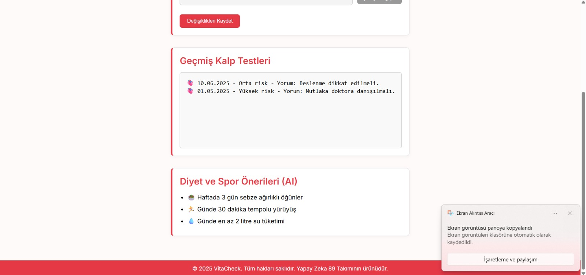

# Takım İsmi: 
**AI - Grup 89**

# Takım Elemanları:
- Yakup Sinan Gedikli - Product Owner
- Rabia Pemik - Scrum Master 
- Gülse Kocabıyık - Developer
- İshak Karataş - Developer
- Osman Furkan Erkan - Developer

# Ürün İsmi: 
**VitaCheck**

## Product Backlog URL:
https://trello.com/b/tQPACGHF/tak%C4%B1m-89

## Ürün Açıklaması:
Kalp hastalıkları, dünya genelinde önde gelen ölüm nedenlerinden biri olup yaşam kalitesini ciddi şekilde düşürmektedir. Erken teşhis ve önleyici müdahaleler hayatiyken, birçok kişi risk faktörlerinin farkında değil veya yoğunluktan dolayı düzenli kontrol yaptıramamaktadır. Bu durum, potansiyel risklerin geç fark edilmesine ve önleyici adımların aksamasına yol açmaktadır.
Bu projeyle, bireylerin kendi kalp sağlıkları konusunda daha bilinçli ve proaktif olmalarını sağlayacak yapay zeka destekli bir çözüm sunmayı hedefliyoruz. Makine öğrenimi algoritmalarıyla kişiselleştirilmiş kalp hastalığı riskini tahmin ediyor ve bu tahmine dayanarak kullanıcılara aksiyon odaklı, anlaşılır yaşam tarzı önerileri sunuyoruz. Böylece kullanıcılar, risklerini erken fark edecek, bilgi sahibi olacak ve kalp sağlıklarını iyileştirmek için somut adımlar atabileceklerdir. Sistemimiz, bir tanı aracı olmaktan çok, kullanıcıları sağlık yolculuklarında güçlendiren ve gerektiğinde bir uzmana yönlendiren bir rehber görevi görecektir.

## Ürün Özellikleri:
**Kişiselleştirilmiş Risk Değerlendirmesi:** Kullanıcının girdiği demografik ve temel sağlık verilerine göre Düşük, Orta veya Yüksek kalp hastalığı risk faktörlerinin sunulması.

**Akıllı Spor Olanakları Listeleme:** Orta ve Yüksek riskli kişiler için yaş ve konuma göre (örneğin, yakınlardaki parklar, spor salonları, yürüyüş yolları) kişiselleştirilmiş spor olanaklarının listelenmesi.

**Kişiye Özel Diyet Önerileri:** Orta ve Yüksek riskli kişilere özel olarak, kalp sağlığını destekleyici ve risk faktörlerini düşürmeye yönelik diyet ve beslenme önerilerinin sunulması.

**Doktora Yönlendirme:** Yüksek riskli kişiler için, detaylı sağlık kontrolü ve profesyonel destek alabilmeleri adına doktor veya ilgili sağlık kuruluşlarına yönlendirme seçeneklerinin sağlanması.

## Hedef Kitle:
* 25 yaş ve üzeri yetişkinler
* Ailesinde kalp hastalığı öyküsü olanlar
* Kalp rahatsızlığı süphesi olanlar

# 📌 Sprint 1
----------------------------------------------------
## Sprint için Tahmin Edilen Tamamlanacak Puan:  
50 Puan

## Tahmin Mantığı: 
Bütün proje 250 puan olarak belirlendi. 
1. Sprint: Araştırma ve Planlama (50 Puan)
2. Sprint: Veri Analizi, Database Tasarımı, Frontend ve Backend (100 Puan)
3. Sprint: Yapay Zeka Entegrasyonu, İyileştirme ve Optimizasyon (100 Puan) olmak üzere karar verildi.

## Daily Scrum: 
Proje süresince sürekli iletişimin sağlanması amacıyla bir Whatsapp Grubu kuruldu. Birinci sprint boyunca 2 kez Zoom toplantısı gerçekleştirildi. Proje kurgusu ve planlaması yapılarak görev dağılımlarına karar verildi. 

  
Toplantı ve Wp Konuşmalarına Dahil Görüntüler

  

  

  

    

## Sprint Board Updates: 
Tamamlanan paketler için takibi trellodan gerçekleştirmekteyiz. Tamamlanan paketlerin görselleri filtrelenerek eklenmiştir.

  
Tamamlanan Paketler

  

  
## Ürün Durumu:

  
Ürün Görselleri
  
  

  

  

  

## Sprint Review: 
- Proje fikrine karar verildi.
- Veri seti seçimi (**Heart Disease Risk Prediction Dataset**) yapıldı.
- Problem-Çözüm, Hedef Kitle, Kısıtlar belirlendi.
- Projenin genel mimarisi belirlendi.
- Görev dağılımları gerçekleştirildi.
- Yol haritası oluşturuldu.
*- Sprint Katılımcıları: Yakup Sinan Gedikli, Rabia Pemik, İshak Karataş, Gülse Kocabıyık, Osman Furkan Erkan*

## Sprint Retrospective: 
Kısa süre içerisinde tüm ekip üyeleriyle iletişimi sağlayabildik. Fakat final haftası, staj ve iş yoğunluğu gibi ekip üyelerinin süreçlerinden dolayı çok yoğunlaşamadık bir sonra ki sprintte daha yoğun çalışılması planlandı. ekip üyeleriyle uygunluk zamanları belirlendi.

# 📌 Sprint 2
----------------------------------------------------
## Sprint için Tahmin Edilen Tamamlanacak Puan:  
100 Puan

## Tahmin Mantığı: 
Bütün proje 250 puan olarak belirlendi. 
1. Sprint: Araştırma ve Planlama (50 Puan)
2. Sprint: Veri Analizi, Database Tasarımı, Frontend ve Backend (100 Puan)
3. Sprint: Yapay Zeka Entegrasyonu, İyileştirme ve Optimizasyon (100 Puan) olmak üzere karar verildi.

## Daily Scrum: 
Proje süresince iletişim Whatsapp Grubu üzerinden sağlanmaya devam etti. İkinci sprint boyunca 1 kez Zoom toplantısı gerçekleştirildi. Toplantıda Veri Analizi tarafında yapılacaklar iş paketleri ve veri üzerine konuşuldu. Frontend tarafında bitirilen paketler ve ürünün son hali incelendi. İyileştirme önerileri sunuldu. Toplantı ve Wp konuşmalarına dahil görüntüler eklenmiştir.

  
Toplantı ve Wp Konuşmalarına Dahil Görüntüler

  

  

    

## Sprint Board Updates: 
Tamamlanan paketler için takibi trellodan gerçekleştirmekteyiz. Tamamlanan paketlerin görselleri filtrelenerek eklenmiştir.

## Ürün Durumu:

## Sprint Review: 
- Proje fikrine karar verildi.
- Veri seti seçimi (**Heart Disease UCI**) yapıldı.
- Problem-Çözüm, Hedef Kitle, Kısıtlar belirlendi.
- Projenin genel mimarisi belirlendi.
- Görev dağılımları gerçekleştirildi.
- Yol haritası oluşturuldu.
*- Sprint Katılımcıları: Yakup Sinan Gedikli, Rabia Pemik, İshak Karataş, Gülse Kocabıyık, Osman Furkan Erkan*

## Sprint Retrospective: 
Kısa süre içerisinde tüm ekip üyeleriyle iletişimi sağlayabildik. Fakat final haftası, staj ve iş yoğunluğu gibi ekip üyelerinin süreçlerinden dolayı çok yoğunlaşamadık bir sonra ki sprintte daha yoğun çalışılması planlandı. ekip üyeleriyle uygunluk zamanları belirlendi.

