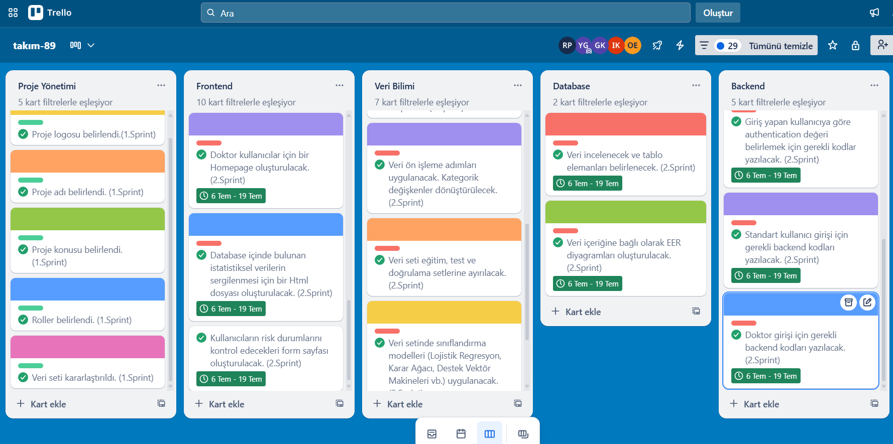

# Takım İsmi: 
**AI - Grup 89**

# Takım Elemanları:
- Yakup Sinan Gedikli - Product Owner
- Rabia Pemik - Scrum Master 
- Gülse Kocabıyık - Developer
- İshak Karataş - Developer
- Osman Furkan Erkan - Developer

# Ürün İsmi: 
**VitaCheck**

## Product Backlog URL:
https://trello.com/b/tQPACGHF/tak%C4%B1m-89

## Ürün Açıklaması:
Kalp hastalıkları, dünya genelinde önde gelen ölüm nedenlerinden biri olup yaşam kalitesini ciddi şekilde düşürmektedir. Erken teşhis ve önleyici müdahaleler hayatiyken, birçok kişi risk faktörlerinin farkında değil veya yoğunluktan dolayı düzenli kontrol yaptıramamaktadır. Bu durum, potansiyel risklerin geç fark edilmesine ve önleyici adımların aksamasına yol açmaktadır.
Bu projeyle, bireylerin kendi kalp sağlıkları konusunda daha bilinçli ve proaktif olmalarını sağlayacak yapay zeka destekli bir çözüm sunmayı hedefliyoruz. Makine öğrenimi algoritmalarıyla kişiselleştirilmiş kalp hastalığı riskini tahmin ediyor ve bu tahmine dayanarak kullanıcılara aksiyon odaklı, anlaşılır yaşam tarzı önerileri sunuyoruz. Böylece kullanıcılar, risklerini erken fark edecek, bilgi sahibi olacak ve kalp sağlıklarını iyileştirmek için somut adımlar atabileceklerdir. Sistemimiz, bir tanı aracı olmaktan çok, kullanıcıları sağlık yolculuklarında güçlendiren ve gerektiğinde bir uzmana yönlendiren bir rehber görevi görecektir.

## Ürün Özellikleri:
**Kişiselleştirilmiş Risk Değerlendirmesi:** Kullanıcının girdiği demografik ve temel sağlık verilerine göre Düşük, Orta veya Yüksek kalp hastalığı risk faktörlerinin sunulması.

**Akıllı Spor Olanakları Listeleme:** Orta ve Yüksek riskli kişiler için yaş ve konuma göre (örneğin, yakınlardaki parklar, spor salonları, yürüyüş yolları) kişiselleştirilmiş spor olanaklarının listelenmesi.

**Kişiye Özel Diyet Önerileri:** Orta ve Yüksek riskli kişilere özel olarak, kalp sağlığını destekleyici ve risk faktörlerini düşürmeye yönelik diyet ve beslenme önerilerinin sunulması.

**Doktora Yönlendirme:** Yüksek riskli kişiler için, detaylı sağlık kontrolü ve profesyonel destek alabilmeleri adına doktor veya ilgili sağlık kuruluşlarına yönlendirme seçeneklerinin sağlanması.

## Hedef Kitle:
* 25 yaş ve üzeri yetişkinler
* Ailesinde kalp hastalığı öyküsü olanlar
* Kalp rahatsızlığı süphesi olanlar

# 📌 Sprint 1
----------------------------------------------------
## Sprint için Tahmin Edilen Tamamlanacak Puan:  
50 Puan

## Tahmin Mantığı: 
Bütün proje 250 puan olarak belirlendi. 
1. Sprint: Araştırma ve Planlama (50 Puan)
2. Sprint: Veri Analizi, Database Tasarımı, Frontend ve Backend (100 Puan)
3. Sprint: Yapay Zeka Entegrasyonu, İyileştirme ve Optimizasyon (100 Puan) olmak üzere karar verildi.

## Daily Scrum: 
Proje süresince sürekli iletişimin sağlanması amacıyla bir Whatsapp Grubu kuruldu. Birinci sprint boyunca 2 kez Zoom toplantısı gerçekleştirildi. Proje kurgusu ve planlaması yapılarak görev dağılımlarına karar verildi. 

  
Toplantı ve Wp Konuşmalarına Dahil Görüntüler

    
    
    
    

## Sprint Board Updates: 
Tamamlanan paketler için takibi trellodan gerçekleştirmekteyiz. Tamamlanan paketlerin görselleri filtrelenerek eklenmiştir.

  
Sprint-1 Tamamlanan Paketler

  

  
## Ürün Durumu:

  
 Sprint-1 Ürün Görselleri

    
    
    
    

## Sprint Review: 
- Proje fikrine karar verildi.
- Veri seti seçimi (**Heart Disease Risk Prediction Dataset**) yapıldı.
- Problem-Çözüm, Hedef Kitle, Kısıtlar belirlendi.
- Projenin genel mimarisi belirlendi.
- Görev dağılımları gerçekleştirildi.
- Yol haritası oluşturuldu.
*- Sprint Katılımcıları: Yakup Sinan Gedikli, Rabia Pemik, İshak Karataş, Gülse Kocabıyık, Osman Furkan Erkan*

## Sprint Retrospective: 
Kısa süre içerisinde tüm ekip üyeleriyle iletişimi sağlayabildik. Fakat final haftası, staj ve iş yoğunluğu gibi ekip üyelerinin süreçlerinden dolayı çok yoğunlaşamadık bir sonra ki sprintte daha yoğun çalışılması planlandı. ekip üyeleriyle uygunluk zamanları belirlendi.

# 📌 Sprint 2
----------------------------------------------------
## Sprint Notları:  
Bu sprint için tamamlamayı hedeflediğimiz iş paketlerini Trello'da takip ettik. Veri Analizi, Frontend, Backend ve Database iş paketlerinin aynı anda en optimum şekilde ilerletebilmek için görev dağılımlarının üzerinden geçtik.
- Veri Analizi kısmını Rabia Pemik ve Gülse Kocabıyık
- Fontend kısmını: Osman Furkan Erkan ve İshak Karataş
- Backend ve Database kısmını: Yakup Sinan Gedikli yürütmesine karar verildi.
Planan tüm iş paketleri 2.Sprint sürecinde tamamlandı.

## Sprint için Tahmin Edilen Tamamlanacak Puan:  
100 Puan

## Tahmin Mantığı: 
Bütün proje 250 puan olarak belirlendi. 
1. Sprint: Araştırma ve Planlama (50 Puan)
2. Sprint: Veri Analizi, Database Tasarımı, Frontend ve Backend (100 Puan)
3. Sprint: Yapay Zeka Entegrasyonu, İyileştirme ve Optimizasyon (100 Puan) olmak üzere karar verildi.

## Daily Scrum: 
Proje süresince iletişim Whatsapp Grubu üzerinden sağlanmaya devam etti. İkinci sprint boyunca 1 kez Zoom toplantısı gerçekleştirildi. Toplantıda Veri Analizi tarafında yapılacaklar iş paketleri ve veri üzerine konuşuldu. Frontend tarafında bitirilen paketler ve ürünün son hali incelendi. İyileştirme önerileri sunuldu. Toplantı ve Wp konuşmalarına dahil görüntüler eklenmiştir.

  
Toplantı ve Wp Konuşmalarına Dahil Görüntüler

    
    
    

## Sprint Board Updates: 
Tamamlanan paketler için takibi trellodan gerçekleştirmekteyiz. Tamamlanan paketlerin görselleri filtrelenerek eklenmiştir.

  
Sprint-2 Tamamlanan Paketler

  
  
  

## Ürün Durumu:

  
Sprint-2 Ürün Görselleri

  
    
    
    
    
    
    
    
    
    
    
    
    
    
    
    
    
  

## Sprint Review: 
Bu sprintte, projemizin temel yapı taşlarından olan veri analizi, frontend vebackend geliştirme konularında önemli ilerlemeler kaydedilmiştir.

**Veri Analizi:**
- Karar verilen veri seti (Kaggle üzerinden) incelenmiştir.
- Verinin inceleneceği ortam Python olarak belirlenmiştir.
- Veri Keşfi (EDA) süreçleri gerçekleştirilmiştir; veri tipleri, aykırı veri tespiti ve eksik veri tespiti çalışmaları yapılmıştır.
- Veri ön işleme adımları uygulanmış ve kategorik değişkenler dönüştürülmüştür.
- Veri seti eğitim, test ve doğrulama setlerine ayrılmıştır.
- Veri setinde sınıflandırma modelleri uygulanmıştır.

**Frontend Geliştirmeleri:**
- Kullanıcıların sistemin amacı ve işleyişi hakkında bilgi alabilecekleri "Hakkında" sayfası oluşturulmuştur.
- Kullanıcı kayıt sayfası oluşturulmuştur.
- Kullanıcı giriş sayfası oluşturulmuştur.
- Standart kullanıcı için bir Homepage (anasayfa) oluşturulmuştur.
- Doktor kullanıcıları için bir Homepage (anasayfa) oluşturulmuştur.
- Database içinde bulunan istatistiksel verilerin sergilenmesi için bir Html dosyası oluşturulmuştur.
- Kullanıcıların risk durumlarını kontrol edecekleri form sayfası oluşturulmuştur.

**Database Geliştirmeleri:**
- Veri incelenerek tablo elemanları belirlenmiştir.
- Veri içeriğine bağlı olarak EER diyagramları oluşturulmuştur.

**Backend Geliştirmeleri:**
- SQLAlchemy yardımı ile .db uzantılı database oluşturulmuştur.
- Kullanıcı giriş ekranında kullanıcı doğrulama işlemi için gerekli kodlar yazılmıştır.
- Giriş yapan kullanıcıya göre authentication değeri belirlemek için gerekli kodlar yazılmıştır.
- Standart kullanıcı girişi için gerekli backend kodları yazılmıştır.
- Doktor girişi için gerekli backend kodları yazılmıştır.

*- Sprint Katılımcıları: Osman Furkan Erkan, Yakup Sinan Gedikli, Rabia Pemik, Gülse Kocabıyık, İshak Karataş*

## Sprint Retrospective: 
Bu sprintte, ekibimizin gösterdiği çaba ve iş birliği sayesinde birçok önemli başarı elde ettik. Aynı zamanda, bir sonraki sprintte daha verimli ve etkili olabilmek adına bazı geliştirme alanlarını da belirledik.

**Artılarımız:**
- 2.Sprint için başarılı bir görev dağılımı gerçekleştirdik. Trello panosunda oluşturduğumuz tüm hedef paketlerimizi tamamladık. Bu sayede Veri Bilimi, Frontend, Backend ve Database alanlarında önemli ilerlemeler kaydedildi.
- Özellikle kullanıcı ve doktor arayüzleri, anket ve risk sonuç ekranı gibi kritik frontend bileşenlerinin hızlıca tamamlanması projenin ilerlemesi adına büyük bir başarıydı.
- Veri analizinden model uygulama aşamasına kadar önemli adımlar atılarak yapay zeka entegrasyonuna güçlü bir temel oluşturuldu.

**Geliştirebileceklerimiz**
- Yoğunluk nedeniyle toplantı sıklığı ve çalışma saatleri konusunda daha iyi bir planlama ihtiyacı doğdu.
- Frontend ve Backend entegrasyonu gibi alanlarda, ilerleyen sprintler için daha detaylı teknik planlamaların yapılması gerektiği görüldü.

**Alınan Kararlar**  
- Projenin son aşamasında tüm süreci daha iyi yönetebilmek adına üç günde bir toplantı yapılmasına karar verildi.
- Özellikle yapay zeka entegrasyonu, database ile model bağlantısı ve iyileştirmeler üzerine daha fazla teknik toplantı ve araştırma yapılmasına karar verildi.

